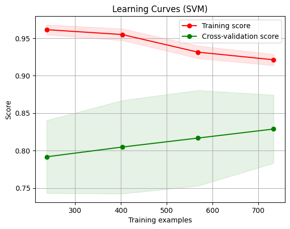
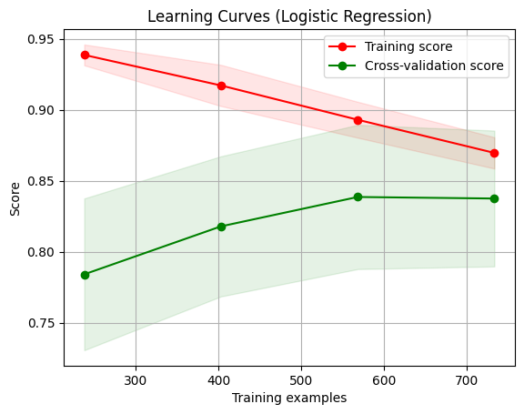

# Projeto de Ciência de Dados - Previsão de Doenças Cardíacas

Este projeto visa desenvolver um algoritmo de Machine Learning para prever a tendência de uma pessoa desenvolver algum tipo de doença cardíaca com base em fatores clínicos e laboratoriais. Utilizou-se um dataset disponível no Kaggle, acessível através do link [Heart Failure Prediction Dataset](https://www.kaggle.com/datasets/fedesoriano/heart-failure-prediction).

## Etapas do Projeto

1. **Análise Exploratória de Dados (EDA)**
   - O arquivo `eda.ipynb` foi utilizado para explorar visualizações dos dados utilizando as bibliotecas Seaborn, Plotly e Pandas.

2. **Limpeza e Tratamento de Dados**
   - No arquivo `cleaning.ipynb`, os dados foram limpos e tratados para remoção de valores ausentes, tratamento de outliers e padronização dos dados utilizando Pandas e NumPy.

3. **Pré-processamento dos Dados**
   - O pré-processamento dos dados foi realizado no arquivo `train.py`, onde os dados foram preparados para o treinamento do modelo. Isso incluiu a codificação de variáveis categóricas, normalização ou padronização de variáveis numéricas e divisão do conjunto de dados em treino e teste. Foram utilizadas as bibliotecas Scikit-learn, Pandas e Pickle para serialização do modelo.

4. **Treinamento do Modelo**
   - Utilizando o `train.py`, o modelo foi treinado com os dados preparados na etapa anterior. Foi aplicada validação cruzada para avaliar a performance do modelo e otimizar os parâmetros.

5. **Teste do Modelo**
   - Após o treinamento, o modelo foi testado utilizando o conjunto de teste separado. Métricas de avaliação foram calculadas para verificar a precisão e eficácia do modelo.

6. **Previsão** (etapa atual)
      - Com todo o pré-processamento dos dados, no qual se refere ao modelo `heart6.pkl`, seguem abaixo a acurácia de cada algoritmo. Ainda pretendo testar com outros.

      - `Naive Bayes`: Acc-Test=84,78%; Acc-Train=86,12%;   Cross-Val=85,17%
      .png)

      - `SVM`: Acc-Test=86,26%; Acc-Train=92,82%; Cross-Val=85,72%
      

      - `LogReg`: Acc-Test=86,23%; Acc-Train=85,80%; Cross-Val=85,83%
      

## Arquivos

- `eda.ipynb`: Notebook utilizado para visualizações exploratórias e entendimento inicial dos dados utilizando Seaborn, Plotly e Pandas.
- `cleaning.ipynb`: Notebook utilizado para a limpeza e tratamento inicial dos dados, utilizando Pandas e NumPy.
- `train.py`: Script Python utilizado para o pré-processamento, treinamento, avaliação e validação cruzada do modelo de Machine Learning. Utilizou-se Scikit-learn, Pandas e Pickle para serialização do modelo.
- Pasta `data`: Contém os arquivos de dados utilizados no projeto.

## Tecnologias Utilizadas
1. Python 3.12.3
2. Jupyter Notebook
3. Algoritmos Naive Bayes, SVM, LogReg

## Contribuição

Este projeto está em constante evolução. Contribuições são bem-vindas! Sinta-se à vontade para abrir issues ou enviar pull requests com melhorias e sugestões.